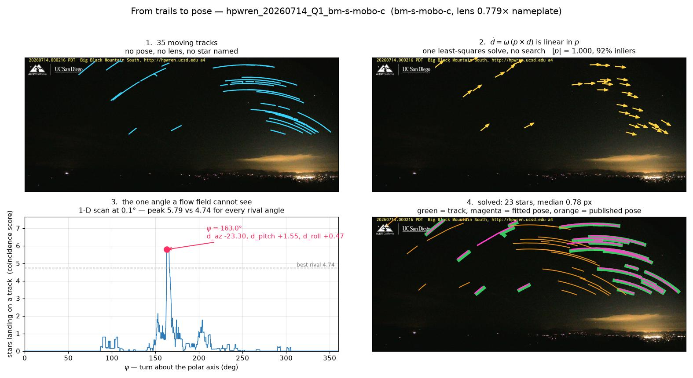

# star-calibration

**Measure a fixed outdoor camera's azimuth, pitch, roll and lens from the stars it already
records at night.** No site visit, no surveyed landmark, no calibration target.



*One 90-minute block from HPWREN's Big Black Mountain South camera. 1: moving point sources,
linked into tracks. 2: the trails' flow field gives the celestial pole in closed form, with no
star named. 3: the pole fixes two angles; a 1-D scan finds the third. 4: stars assigned to
whole tracks and refit — 23 stars at a median 0.78 px — against the published pose (orange),
which is 23.3° off.*

Built for [HPWREN](https://www.hpwren.ucsd.edu/)'s wildfire cameras, where the published
camera table is a nameplate: azimuths rounded to a compass quadrant, a nominal field of view,
no lens model. Every bearing drawn from those cameras inherits that error. The same method
applies to any fixed camera that sees a patch of night sky.

## What it found on HPWREN

From ten nights between 2026-07-14 and 2026-09-25, on frames from HPWREN's public CDN
([`hpwren/pose_ledger.json`](src/star_calibration/hpwren/pose_ledger.json)):

- **106 solves on 73 cameras**, at a median residual of 1.3 px and 21 stars per solve.
- **44 of the 73 cameras point more than 1° from their published azimuth,** 10 of them by more
  than 5°. mlo-s-mobo-c is off by 23°.
- **Nights agree to hundredths of a degree.** The acceptance test that matters is a second
  night landing on the same pose, not a star count (`cross_night.py`).
- **The lens is not what the table implies.** The 90° units are equidistant fisheyes at
  0.877–0.894 of the nameplate scale, spanning about ±55°, not rectilinear ±45°. Big Black
  Mountain's cameras are a second lens group at 0.775–0.779. Near the frame edge the difference is
  worth up to 8° of bearing.
- **Cameras get re-aimed,** so a pose is a measurement on a date. The ledger says when one
  applies to another date, and refuses to bridge an apparent re-aim (`ledger.py`).

Downstream, in [plume-triangulation](https://github.com/rharnish/plume-triangulation), these
poses are scored in kilometres of wildfire-location error. They are also checked against
terrain: the skyline predicted from a DEM through the star-solved pose lands on the image edge
to a third of a pixel.

## How a solve works

1. **Tracks** (`tracks.py`). Detect point sources in every dark frame and link them frame to
   frame. Keep what persists and moves: hot pixels and lens artefacts stay put, stars drift at
   the sidereal rate. The monochrome (NIR) units get a noise-scaled detector and a
   constant-velocity linker.
2. **Pole** (`pole.py`). For a star at direction *d*, *ḋ = ω (p × d)*, which is linear in the
   celestial pole *p*. One least-squares solve over all trails gives the pole in camera
   coordinates, with no catalog and no search. Its length measures the lens scale.
3. **Scan** (`solve.py`). The pole fixes two angles. Scan the turn about it at 0.1°, scoring
   how many bright catalog stars land on *any* track. A grid around the published pose runs
   too, as a separate attempt.
4. **Assign and refit.** Match catalog stars to whole tracks (Hungarian assignment on median
   track distance) and refit pose — then pose and lens — with a robust loss, tightening the
   match radius as it converges. A solve needs ≥ 8 stars under 3 px median, and the lens inside
   a plausible band.

Star positions carry proper motion, IAU 1976 precession and refraction. Skipping precession
alone leaves about 0.3° of azimuth in every 2026 solve (`catalog.py` documents the chain). Every
solve records the sky model it used, and a ledger refuses to mix models.

## Use

```sh
pip install "star-calibration[opencv] @ git+https://github.com/rharnish/star-calibration"
```

Leave out `[opencv]` if your environment already has an OpenCV build.

**As a library,** with frames from anywhere:

```python
from star_calibration.tracks import collect
from star_calibration.solve import Night, solve_wide

t0 = 1789112704  # the epoch track offsets count from
frames = [...]   # (epoch, epoch - t0, jpeg bytes), in time order
tracks, decoded = collect(frames, lat=33.1, lon=-116.8)
cam = {"lat": 33.1, "lon": -116.8, "elev": 1600, "az": 180, "fov": 90}  # published pose
r = solve_wide(Night(camera="my-cam", cam=cam, t0=t0, tracks=tracks))
r["status"], r["pose"]   # 'solved', {'d_az', 'd_pitch', 'd_roll', 'k_ratio', 'k1'}
```

**On HPWREN,** see [`src/star_calibration/hpwren/`](src/star_calibration/hpwren/README.md):

```sh
python -m star_calibration.hpwren.calibrate fetch 20260911 hp-s-mobo-c vo-n-mobo-c
python -m star_calibration.hpwren.calibrate solve
python -m star_calibration.hpwren.calibrate agree
```

## Layout

| module | |
|---|---|
| `catalog` | bright-star catalog (HYG, mag ≤ 4) and apparent alt/az for any epoch and site |
| `fisheye` | the lens model, pixel ↔ direction, and the shared HPWREN lens |
| `tracks` | point-source detection and linking |
| `pole` | the pole from trails, and the pose family it implies |
| `solve` | `Night`, `solve`, `solve_wide` |
| `cross_night` | night-to-night agreement |
| `overlay` | a solve drawn on its own frame: tracks, fitted stars, and the published pose's error |
| `animate` | a solve played back as video from its trace: pole, coarse search, refinement, verdict |
| `explore` | the same trace as data for a browser replay, every star already projected |
| `ledger` | per-camera, per-date poses, and when one applies |
| `sun`, `moon` | dark-frame selection; moonlit nights solve as well as dark ones |
| `hpwren/` | HPWREN's camera table, CDN nights, a command-line calibrator, the solved ledger |

Every record the package and its HPWREN pipeline produce, from the camera table and pose
ledger to the cache's tracks, solves and weather, is described field by field, with units
and rules, in [docs/records.md](docs/records.md).

`pytest` runs in ~15 s with no data. It includes an end-to-end solve of a synthetic night:
catalog stars through a known, off-nameplate camera, back to that camera to 0.03°.

## History

This began as the camera-calibration stage of
[plume-triangulation](https://github.com/rharnish/plume-triangulation) and was split out
with its git history. That repository's `NOTES.md` is the lab notebook for how each piece was
built and tested, including what failed; docstrings here cite it by date.

## Attribution

- **HPWREN** — camera frames and the camera table (`hpwren/sites.js`, `hpwren/cams.json`).
  Use of HPWREN data requires a credit reference to <https://www.hpwren.ucsd.edu/>.
- **HYG Database** — [astronexus/HYG-Database](https://github.com/astronexus/HYG-Database),
  CC BY-SA 4.0. `data/bright_stars.json` is a filtered derivative (mag ≤ 4) under the same
  license.
- **Prior work** — R. Quimby, [*Using the Stars for Altitude-Azimuth Calibration of HPWREN
  Cameras*](https://www.hpwren.ucsd.edu/news/20240920/index.html), HPWREN, 20 September 2024.

## License

Code is MIT ([LICENSE](LICENSE)). `src/star_calibration/data/bright_stars.json` is
CC BY-SA 4.0, as derived from HYG.
